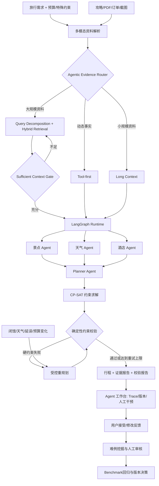

# TripPilot-Evidence

一个以旅行规划验证复杂任务执行能力的 **Agent Workbench**。系统通过 Agentic Evidence Router 在实时工具、Long Context 和 Hybrid Retrieval 之间选择证据策略，由 LangGraph 编排多 Agent 执行，结合 CP-SAT 硬约束求解、确定性校验、局部重规划、Trace 和数据飞轮，生成可执行、可验证、可恢复的旅行方案。

## 项目动机

通用旅行规划 Demo 通常存在三个问题：用户已预订的酒店、车票和收藏攻略没有被可靠利用；模型可能生成看似合理、实际无来源的价格和坐标；日期、预算、每日强度等约束只写在 Prompt 中，无法保证执行结果满足。

TripPilot-Evidence 将这些问题拆成“资料理解—证据路由—充分性判断—多 Agent 执行—约束校验—自动修复”六个可独立评测的阶段。

### 项目定位

项目不以“生成一篇旅行攻略”为主要目标，而是验证 Agent 如何选择实时工具与私有资料、如何保证预算和时间窗等硬约束、如何在环境变化后最小化修改范围，以及如何通过 Trace、校验报告、方案版本和用户反馈复核一次完整运行。旅行规划只是验证场景，这些 Harness 能力可以迁移到其他复杂规划任务。

## 核心能力

- **多模态资料理解**：支持 TXT、Markdown、JSON、CSV、PDF，以及攻略截图、订单、车票等图片；图片由视觉语言模型提取地点、时间、价格和限制条件。
- **Agentic Evidence Retrieval**：根据资料规模和时效性在 Tool-first、Long Context 与 Hybrid Multi-query 之间路由；大资料执行查询拆解和融合召回，上下文不足时自动扩大检索。
- **证据充分性门控**：计算目的地、旅行偏好、特殊约束和额外要求的证据覆盖率，显式记录缺失维度、检索轮次和回退策略。
- **混合检索底座**：BM25 与 Dense Embedding 双路召回，通过 RRF 融合排序；每个 Chunk 保存来源文件、Source ID 和 Chunk ID。
- **多 Agent 编排**：景点、天气和酒店 Agent 通过 MCP 并行调用高德地图工具，Planner Agent 汇总实时信息与个人资料。
- **神经符号行程求解**：LLM 负责理解需求和生成候选，OR-Tools CP-SAT 负责景点选择、时间窗排程、预算与交通间隔约束。
- **确定性约束引擎**：独立校验日期覆盖、每日景点数、三餐、坐标合法性、预算和求解状态，不依赖 LLM 自评。
- **自动重规划**：硬性约束未通过时，将结构化问题和字段路径反馈给 Planner，执行一次受控修复并重新校验。
- **动态扰动恢复**：支持景点闭馆、天气变化、交通延误、预算变化和用户临时修改；只替换受影响日期，保留其他行程并递增 Revision。
- **可观测输出**：返回证据策略、查询拆解、充分性得分、检索证据、Validation Report、是否发生修复以及 Trace ID。
- **回归评测**：提供 JSONL Benchmark 和批量评测脚本，统计约束通过率与平均规划延迟。
- **数据飞轮**：在用户授权后沉淀完整 Episode，并根据低校验分、自动修复、动态重规划、求解失败和用户拒绝等信号自动挖掘难例候选。
- **链路穿刺**：同一 Trace ID 串联检索排名、领域 Agent、候选生成、CP-SAT 求解、约束校验、重规划和用户反馈，可在前端逐阶段查看证据。

## 系统架构



## 技术栈

- **Agent 与后端**：Python、FastAPI、Pydantic v2、LangGraph、LangChain、MCP、高德地图 MCP Server
- **上下文与多模态**：Agentic Retrieval、Long Context、BM25、Dense Embedding、RRF、PyPDF、OpenAI-compatible VLM
- **前端**：Vue 3、TypeScript、Vite、Ant Design Vue、高德地图 JavaScript API、jsPDF

## 工作流状态

```text
START
  -> retrieve（Agentic Evidence Router + Sufficient Context Gate）
  -> attraction / weather / hotel（并行）
  -> planner（生成结构化 TripPlan）
  -> optimize（CP-SAT 选择、排序与时间窗排程）
  -> validate（确定性约束引擎）
  -> repair（失败时最多一次）
  -> validate
  -> END
```

系统移除了原项目在解析失败时构造虚假景点和坐标的降级逻辑。无法生成符合 Schema 的计划时接口明确失败；缺少地图证据的坐标保持为空，并在 Validation Report 中标记。

## 快速开始

### 后端

```bash
cd backend_langgraph
python -m venv .venv
# Windows: .venv\Scripts\activate
# macOS/Linux: source .venv/bin/activate
pip install -r requirements.txt
pip install uv
copy .env.example .env
python run.py
```

必要配置：

```dotenv
AMAP_API_KEY=your_amap_key
LLM_API_KEY=your_llm_key
LLM_BASE_URL=https://api.openai.com/v1
LLM_MODEL_ID=gpt-4o-mini
```

启用神经网络语义向量：

```dotenv
USE_SENTENCE_TRANSFORMERS=true
EMBEDDING_MODEL=BAAI/bge-small-zh-v1.5
```

未开启时系统使用稳定哈希向量作为零下载开发后端，BM25、RRF、来源追踪和完整流程仍可运行。

### 前端

```bash
cd frontend_v2
npm install
npm run dev
```

浏览器访问 `http://localhost:5173`。运行时状态来自后端 `/health`：依赖完整显示 `Agent Ready`，缺少 LLM、地图 Key 或 `uvx` 时显示 `Runtime Degraded`。

## API

| 方法 | 路径 | 说明 |
|---|---|---|
| POST | `/api/knowledge/upload` | 上传文本、PDF 或图片资料并建立索引 |
| POST | `/api/knowledge/search` | 查看 BM25/Dense 排名及融合结果 |
| POST | `/api/knowledge/evidence/route` | 查看 Tool/Long Context/Hybrid 路由与证据充分性 |
| GET | `/api/knowledge/stats` | 查看资料数、Chunk 数和 Embedding 后端 |
| POST | `/api/trip/plan` | 生成带证据与校验报告的旅行计划 |
| POST | `/api/trip/replan` | 根据闭馆、天气、延误等扰动执行局部重规划 |
| POST | `/api/flywheel/feedback` | 提交接受、评分及修改反馈 |
| GET | `/api/flywheel/trace/{trace_id}` | 穿刺完整决策事件链 |
| GET | `/api/flywheel/hard-cases` | 查看自动挖掘的授权难例 |
| GET | `/api/flywheel/stats` | 查看飞轮数据质量与反馈统计 |
| GET | `/api/poi/search` | 搜索 POI |
| GET | `/api/map/weather` | 查询天气 |
| POST | `/api/map/route` | 规划路线 |

API 文档：`http://localhost:8000/docs`

## 测试与评测

运行离线单元测试：

```bash
cd backend_langgraph
pytest -q
```

启动服务后运行端到端 Benchmark：

```bash
python benchmarks/evaluate_benchmark_20.py
python benchmarks/evaluate.py --base-url http://localhost:8000
python benchmarks/evaluate_disruptions.py --base-url http://localhost:8000
python benchmarks/build_flywheel_dataset.py --output benchmarks/flywheel_candidates.jsonl
```

完整评测集位于 `benchmarks/benchmark_20.jsonl`，覆盖普通规划、预算、营业时间、无障碍/饮食、闭馆、天气、延误以及证据缺失/冲突。统一 Runner 会自动上传测试资料、解析动态闭馆目标，并输出自动化通过率、人工复核项、Validation Score、计划稳定性和平均端到端延迟。

稳定演示案例：

```bash
python benchmarks/demo_case/run_demo.py
```

演示脚本使用当前日期后 7 天，并从初始结果动态选择闭馆目标，详细说明见 `benchmarks/README.md`。简历中的效果数字应以实际环境运行结果为准，不在 README 中预设虚构指标。

## 项目结构

```text
backend_langgraph/
├── app/
│   ├── agents/trip_planner_agent.py   # LangGraph 多 Agent 与修复闭环
│   ├── api/routes/knowledge.py        # 多模态资料 API
│   ├── models/schemas.py              # 请求、行程、证据和校验 Schema
│   └── services/
│       ├── document_ingestion.py      # 文本/PDF/VLM 图片抽取
│       ├── evidence_orchestrator.py   # Tool/Long Context/Hybrid 自适应路由
│       ├── hybrid_retriever.py        # BM25 + Dense + RRF
│       ├── itinerary_optimizer.py      # OR-Tools CP-SAT 神经符号调度
│       ├── experience_store.py         # SQLite Episode、反馈与穿刺事件
│       └── constraint_engine.py       # 确定性约束校验
├── benchmarks/                        # JSONL 回归集与评测脚本
└── tests/                             # 离线单元测试
frontend_v2/                           # Vue 3 Agent 工作台、结果与版本界面
```

## Agent 与 Skill 的边界

如果需求只是“根据输入生成旅行攻略”，更适合实现为 Skill。本项目保留独立 Agent Runtime，是因为它负责并行工具调用、跨阶段状态、CP-SAT 求解、确定性校验、事件驱动重规划、Trace、方案版本和数据飞轮。需求抽取、资料解析和检索策略仍可封装成 Skill，并以本系统作为执行后端：**Skill 解决能力复用，Agent Harness 解决复杂任务的稳定执行、验证和持续改进。**

## 数据飞轮边界

数据不会未经审核直接用于训练或修改线上策略：

1. 默认只保存运行指标和输入指纹，不保存完整请求及行程；
2. 用户主动开启学习授权后，完整 Episode 才可进入难例候选；
3. 外部资料正文不写入事件表，链路中仅记录 Source/Chunk 标识；
4. 自动挖掘结果统一标记为 `PENDING_HUMAN_REVIEW`；
5. 审核后的样本进入 Benchmark，候选版本通过回归后才能接受。

## 许可证

CC BY-NC-SA 4.0
